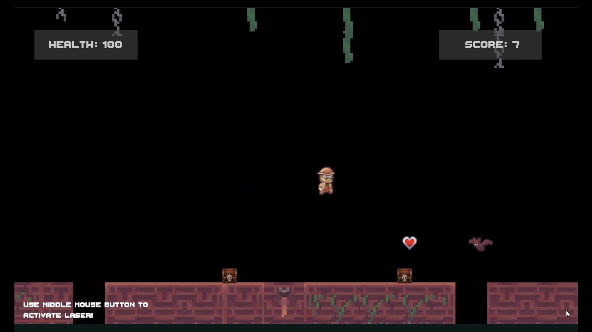

# Unity project for an endless runner 

## Game Preview

[Link to gameplay video](https://drive.google.com/file/d/1z8hRTFN0IH200GtZeCdWZAL2wafPSCLA/view?usp=sharing)

## Overview
This project was fully designed and programmed by me as part of a college assignment completed in three weeks.
It was developed on Unity using C#.

## Game Features
- **Generic pool system** used for the enemies, extra health, map prefabs, and VFX
- **Enemies** – Handles movement, collisions, and on-hit damage behavior.
- **Healing system** - Restores player health through pickups.
- **Acceleration in map movement**
- **VFX** for player/enemy dying, player getting healed, and laser hit contact
- **UI** - Score and player's health is shown in screen
- **Laser** ability:
  - Uses a contact filter
  - Damage over time
  - Displays hit-based VFX
  - Damage scales down when hitting multiple enemies
  - Has a cooldown after using it
  - All variables can be mpdified allowing easy costumization
  - Uses lineRenderer
  - LineRenderer changes color over firing time

## Development Requirements
 As the project was part of a college assignment, specific guidelines had to be followed: 
- Implement a functional laser ability
- Use a single health system shared by both player and enemies
- Create an on-collision damage system for enemies
- Ensure all code is clearly commented and documented
